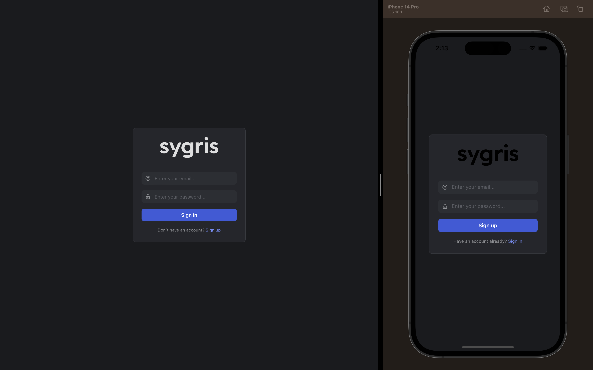
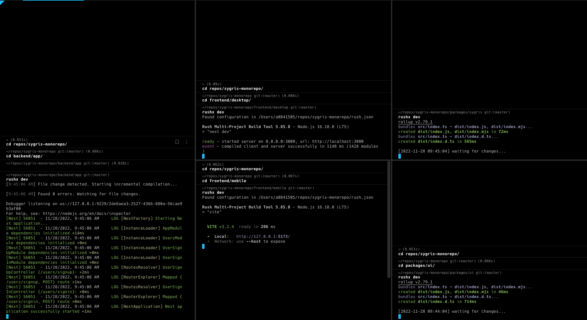

# Sygris monorepo

This is a small monorepo prepared for the Sygris technical interview. It is composed of 5 repos:

* `@sygris/backend`: A small backend with NestJS.
* `@sygris/mobile`: A native mobile client for both IOS and Android using Capacitor.
* `@sygris/desktop`: A web app served with Next.js. This app is also packaged as a desktop native app using Tauri.
* `@sygris/ui`: An independent repo for shared elements between clients.
* `@sygris/core`: An independent repo that includes all businness logic.

### Overview

This monorepo is my solution to the technical test required by Sygris.

Quick overview: I consider very important to have business logic decoupled from specific implementations (backend/frontend apps) in order to allow companies to adapt to possible major changes in the always-changing tech landscape. This gives us the flexibility to switch the tech stack without paying a hell-of-cost for it. In that sense, the main business logic is contained in the `@sygris/core` repo, that includes the domain, application and infrastructure layers. This is the main package of the monorepo and the less susceptible to future changes.

The `@sygris/backend` app was not specified in the test but I wanted to simulate a real-life scenario where the clients usually do not communicate directly with external services, but through a company API. It basically sets up a series of controllers to communicate with our application services exposed by the core package.

Regardless the client apps: the `@sygris/ui` package acts as a SDK to develop React apps. All shared elements between our clients is hosted in this package, allowing us to have them decoupled from specific client implentations. This includes hooks, components, themes, etc. 2 different apps have been included in the monorepo as an example: a desktop app (Web, Desktop - `@sygris/desktop`) and a mobile app (iOS, Android - `@sygris/mobile`).



## Main technologies used

* [Rush](https://rushjs.io/): Scalable monorepo build orchestrator
* [pnpm](https://pnpm.io/): Dependencies package manager
* [NestJS](https://nestjs.com): Framework for backend server app
* [Next.js](https://nextjs.org/): Development framework for web apps
* [Capacitor](https://capacitorjs.com/): Native runtime for building mobile apps
* [Mantine](https://mantine.dev/): A fantastic library of React components
* [Tauri](https://tauri.app/): Construction toolkit for cross-OS desktop app
* [Vite](https://main.vitejs.dev): Modern frontend tooling with excellent performance
* [Rollup](https://main.vitejs.dev): Modern frontend tooling with excellent performance

### Justification

* **Rush**: I've tried several monorepo manager and Rush is the best for me: it's very performant, handle paralell operations, its cache system works very well and its dependencies sync its the best I've used up to the moment. As a plus, it's mantained and used by Microsoft in production in many projects which makes it very reliable.
* **Pnpm**: Of all the dependencies manager supported by Rush Pnpm is the best by far. It's several times faster that npm and yarn it's still not-fully approved by the Rush team.
* **Next.js**: One of the best frameworks to create web apps using SSR and SSG. Well documented, supported by Vercel and a large community, and being extensively tested in prod makes me choose it (againts other options as Remix).
* **NestJS**: I have no special preference for it but I wanted to use the same backend app as Sygris. Its dependency injection system is cool though.
* **Rollup**: After using Webpack for many years I realised that most of its featues are not really being used. As a much simpler option, Rollup works pretty well and its TS compiler works much faster that the native one.
* **Vite**: I choose Vite because the DX is great, and it uses Rollup under the scenes, which aims for consistency all across our projects. It's interesting using it since they have already commented their plans to switch to Turbopack (Vercel) in the future.
* **Mantine**: Not much to say, I like the JSS solution and the original styles.

## Scripts

```bash
# Install packages
rush update

# Build projects
rush build

# Do a clean rebuild of everything
rush rebuild

# Do a clean installation of everything
rush update --full -p

# Work on one project
cd ./my-project && rushx $script

# All projects include the following scripts:
rushx dev # Dinamically serves the projects content with hot reloading
rushx serve # Statically serves the build output
rushx build # Build the project
rushx test # Run the tests

# Additionally, some include specific scripts for their cases (see package.json)
```

Remember that all projects can be run in parallel with static and dynamic serving.



## First-time instructions

1. Install projects dependencies and generate builds:

```bash
rush update && rush build
```

2. All projects can be served in parallel. Go to each project and run:

```bash
rushx serve # To serve the production version
#or
rushx dev # To serve the content with hot-reload
```

As to easily check the technical test I recommend just starting the API and the Next.js projects:

```bash
rushx serve #In backend/app - This starts up the API
rushx serve # In frontend/desktop - This starts up the Next.js project
rushx test # In frontend/desktop - To run the E2E tests. Both previous scripts must be running.
```

> Next step is only necesary to inspect mobile apps in their native dev environment (XCode, Android Studio - install required), the app can be run as a web app locally.

3. Go to `frontend/mobile` and run:

```bash
rushx setup
```

## Setting Up macOS

### Rush

To install Rush, enter the following command in the terminal:

```bash
npm install -g @microsoft/rush
```

### Pnpm

To install Pnpm, enter the following command in the terminal:

```bash
npm install -g pnpm
```

### Nest CLI

To install Nest CLI, enter the following command in the terminal:

```bash
npm install -g @nestjs/cli
```

### Instructions for native apps (Desktop and Mobile) (optional)

#### CLang and macOS Development Dependencies

You will need to install CLang and macOS development dependencies. To do this, run the following command in your terminal:

```bash
xcode-select --install
```

#### Rust

To install Rust on macOS, open a terminal and enter the following command:

```bash
curl --proto '=https' --tlsv1.2 <https://sh.rustup.rs> -sSf | sh
```

#### CocoaPods

Cocoapods is an iOS dependency manager that Capacitor uses to install and manage native dependencies for your iOS project.

```bash
brew install cocoapods
```

#### Mobile App (native)

The app can be developed without creating a native packaging in the repo.
For inspecting the native bundle the proper platform for each system is required.

##### Xcode

Xcode is required in order to lauch the packaged iOS version of `@sygris/mobile`

##### Android Studio

Android is required in order to lauch the packaged Android version of `@sygris/mobile`
